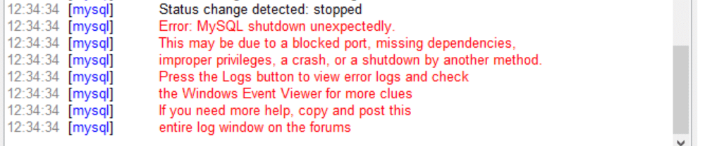

# 🛠️ Script para solucionar error de MySQL en XAMPP: "MySQL shutdown unexpectedly"

Este repositorio contiene un script en **batch (.bat)** para restaurar la carpeta `data` de **MySQL en XAMPP** cuando aparece el error:

  

El script automatiza el proceso de recuperación usando la carpeta `backup` que viene por defecto en XAMPP, y copia las bases de datos de proyectos para que no se pierdan.

---

## 📂 Ubicación del script
El archivo debe guardarse dentro de la carpeta:
C:\xampp\mysql
---

## 🚀 Cómo usarlo
1. **Detén MySQL** desde el panel de control de XAMPP.  
2. Coloca el archivo `restaurar_mysql.bat` dentro de la carpeta `C:\xampp\mysql\`.  
3. Haz clic derecho en el archivo y selecciona **"Ejecutar como administrador"**.  
4. Espera a que el script finalice.  
5. Reinicia MySQL desde XAMPP.  

---

## 📋 ¿Qué hace el script? (paso a paso)

1. **Renombra la carpeta `data` actual** agregando un timestamp, por ejemplo:  data_bk_20250814_9%e%f

2. **Copia la carpeta `backup` de MySQL** y la renombra como una nueva `data`.

3. **Restaura el archivo `ibdata1`** desde la carpeta de respaldo renombrada (`data_bk_...`) hacia la nueva carpeta `data`.  
> Este archivo es crítico porque guarda la información de las bases de datos InnoDB.

4. **Copia las carpetas de proyectos de bases de datos**, excepto las siguientes carpetas internas de MySQL:  
- `mysql`  
- `test`  
- `phpmyadmin`  
- `performance_schema`

5. Muestra un mensaje de confirmación:
   Restauración completada
---

